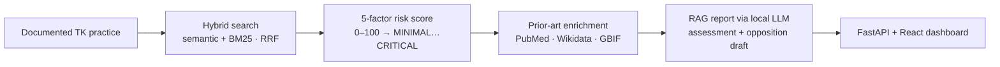

# 🛡️ TK-Shield

### Defensive bio-piracy monitoring for Traditional Knowledge

TK-Shield protects documented **Traditional Knowledge (TK)** — traditional medicinal and agricultural practices such as *turmeric for wound healing* or *neem as a crop antifungal* — from patents that misappropriate it. It answers one question for the communities, NGOs, and patent offices that need it:

> **“Has someone patented our traditional knowledge — and can we prove prior art to stop them?”**

Given a documented practice, TK-Shield finds the patents that may claim it, scores bio-piracy risk, gathers citable prior-art evidence from free public sources, and drafts a citation-backed assessment plus a patent opposition — entirely **keyless and offline-first**, so any community can run it on a laptop.

---

## The result, first

The three landmark bio-piracy disputes — **turmeric** (`US5401504A`), **neem** (`EP0436257B1`), and **basmati** (`US5663484A`) — were each historically revoked using documented prior art. TK-Shield was evaluated on whether it can independently re-identify them from **folk-worded TK descriptions that share no text with the patents**:

| Metric | Result |
|---|---|
| Correct patent retrieved in the top 5 (**Precision@5**) | **100 %** |
| Correct patent ranked #1 (**Precision@1**) | **67 %** |
| Mean Reciprocal Rank | **0.833** |
| Cases scored **HIGH / CRITICAL** risk | **100 %** |

All three were flagged **CRITICAL** and retrieved as the closest or second-closest match, from a corpus of **16,371 real US patents**. Reproduce it:

```bash
PYTHONPATH=. python -m src.evaluation.landmark_eval   # writes docs/evaluation_report.md
```

---

## Why it matters — alignment with WIPO’s mandate

TK-Shield operationalizes the **defensive protection** of traditional knowledge that international IP policy is converging on:

- **WIPO IGC** — the Intergovernmental Committee on Intellectual Property and Genetic Resources, Traditional Knowledge and Folklore, whose core agenda is preventing the erroneous granting of patents over TK.
- **WIPO Treaty on IP, Genetic Resources and Associated Traditional Knowledge (2024)** — introduces a *disclosure-of-origin* requirement for patents based on genetic resources and associated TK. TK-Shield directly supports this: it links a practice to the patents claiming it and assembles the origin evidence.
- **Nagoya Protocol / CBD** — access and benefit-sharing depends on knowing *which community* holds a practice. TK-Shield surfaces documented **communities & peoples** (e.g. Santal, Seri, Kwakiutl) as a first-class attribution dimension.
- **TKDL** — India’s Traditional Knowledge Digital Library is the proven model; TK-Shield mirrors its defensive purpose with open data and open models.

Every risk claim ties to a **stable, verifiable reference** — a PubMed PMID, a Wikidata QID, a GBIF key, or a patent number — so the output is evidence, not assertion.

---

## What it does



1. **Find** — hybrid semantic + keyword search (Reciprocal Rank Fusion) over the patent corpus rescues folk, multilingual, and scientific synonyms a single method would miss.
2. **Score** — a transparent 5-factor model (similarity, temporal proximity, geographic overlap, assignee profile, patent class) yields a 0–100 risk score and a MINIMAL→CRITICAL band.
3. **Gather** — keyless fan-out to PubMed, Wikidata, and GBIF returns one deduped, citation-tagged evidence bundle (and notes any source that was unavailable).
4. **Generate** — a local LLM (Ollama) writes a citation-backed assessment and a draft opposition; with no LLM it falls back to a deterministic template (figures and citations stay exact).

## Three personas, one platform

- **🛡️ Defender** (communities / NGOs) — register a practice, run a risk check + full RAG report, monitor newly-filed patents, export an opposition draft. The risk recommendations point to real channels: **WIPO PATENTSCOPE**, **TKDL**, and the **WIPO IGC**.
- **⚖️ Examiner** (patent offices) — paste a patent’s text and get a novelty verdict (LIKELY NOT NOVEL / POSSIBLE PRIOR ART / LIKELY NOVEL) against the documented TK registry, with the matching prior art.
- **📊 Researcher** — analytics across the registry and corpus: domains, geography, **documented communities & peoples**, and top assignees.

## At a glance

- **16,371** real US patents (PatentsView bulk — real titles, assignees, grant dates)
- **2,030** documented TK practices (Dr. Duke CC0 ethnobotany + curated multilingual Wikidata)
- **Keyless** end-to-end · **offline-first** · **no runtime CDN** · local LLM optional
- Backend: **48** network-free tests · Frontend: **21** tests (incl. XSS-safety regressions)

## Screenshots

| Defender — risk result | Examiner — novelty verdict |
|---|---|
|  |  |
| **Researcher — analytics** | **Landing** |
|  |  |

> Capture instructions in [docs/screenshots/README.md](docs/screenshots/README.md).

---

## Design principles (non-negotiable)

- **Free & keyless first.** The entire pipeline runs with **zero API keys** on public-domain / open data and a local model. No paid or registration-gated services.
- **Graceful degradation.** No external source (or the LLM) can crash the pipeline; clients return empty on failure and reports note what was skipped. Everything works offline.
- **Citations, not hand-waving.** Every claim carries a stable reference ID.
- **Security by construction.** Server/LLM/user text is never injected as raw HTML; external links are scheme-validated; request inputs are bounded.

## Quick start

```bash
# 1. Install (Python 3.11)
python3.11 -m venv venv && source venv/bin/activate
pip install -r requirements.txt
python -m spacy download en_core_web_sm
python -m nltk.downloader stopwords

# 2. (Optional) local LLM for AI-written reports — works without it too
#    Install Ollama from https://ollama.com, then:
ollama pull llama3.2

# 3. Build the patent corpus — keyless, REAL metadata (one-time bulk download)
PATENT_SOURCE=patentsview_bulk MAX_PATENTS=20000 python -m src.ingestion.build_corpus
python -m src.ingestion.ingest_to_chromadb      # embed + index into ChromaDB
python -m src.ingestion.seed_landmark_cases     # add the real bio-piracy cases

# 4. Build the TK registry from open sources
TK_SOURCE=duke     TK_IMPORT_LIMIT=2000 python -m src.ingestion.build_registry  # Dr. Duke CC0
TK_SOURCE=wikidata TK_IMPORT_LIMIT=50   python -m src.ingestion.build_registry  # multilingual seed

# 5. Run — frontend (Vite + React) + API on one origin
npm --prefix frontend install && npm --prefix frontend run build
uvicorn api.main:app          # → http://localhost:8000   (API docs at /docs)
```

For live development with hot-reload, run the backend with `--reload` and `npm --prefix frontend run dev` (Vite on :5173 proxies `/api` → :8000).

## Tech stack

**Backend** FastAPI · ChromaDB (vector search) · in-memory BM25 · SQLite (registry) · sentence-transformers · spaCy NER · resilient `httpx` clients · Ollama (local LLM) ·
**Frontend** Vite + React 18 + TypeScript · TanStack Query · Tailwind v4 · Radix · Vitest.

See **[CLAUDE.md](CLAUDE.md)** for full architecture, and **[docs/evaluation_report.md](docs/evaluation_report.md)** for the latest evaluation.

## Tests

```bash
PYTHONPATH=. pytest tests/ -q          # backend — network-free, fixture-based
npm --prefix frontend run test         # frontend — Vitest (incl. XSS-safety)
```

See **[VERIFICATION.md](VERIFICATION.md)** for reproducible evidence (commands + observed output) behind every
claim here, and a ~2-minute keyless demo path.

## Limitations

TK-Shield is **decision-support that flags candidates for expert human review — it does not establish or prove
misappropriation.** Known limits:

- **Scope** — US patent *metadata* (titles, abstracts, assignees, dates), not full claim text; non-US full text not yet covered.
- **Language** — analysis is English-centric; multilingual TK names are matched but the pipeline is English-first.
- **Model** — the local LLM is small (`llama3.2`, ~3B); narrative quality is below frontier API models — a deliberate keyless/offline trade-off, with an exact deterministic fallback.
- **Risk model** — interpretable hand-weighted factors, not learned from a labelled dataset.
- **Evaluation** — demonstrated on the three landmark cases; not yet a large labelled benchmark, so no population-level false-positive rate.
- **Data** — the ethnobotany source is broad but skews to English-documented knowledge, under-representing some communities.
- **Deployment** — hardened for local/single-user; **no authentication, rate limiting, or restricted CORS** — the gating items for any public hosting.

## Future work

- A larger, expert-labelled evaluation benchmark (precision/recall at scale).
- Full-text and non-US patent coverage; multilingual TK ingestion at scale.
- Continuous monitoring + alerting for newly-filed patents.
- Multi-tenant deployment (auth, rate limiting, CORS) for institutional use.
- Community consent and governance as a first-class feature.

## Author & role

Designed and directed by **Ansul Suryawanshi** as an AI-assisted engineering project, applying an AI/ML and
environmental-science background to the defensive protection of traditional knowledge. The architecture,
data-source, evaluation, security, and product decisions are mine — keyless / offline-first design, hybrid
retrieval over pure embeddings, an interpretable risk model, the three-persona structure, the community-
attribution feature, and the WIPO policy framing — and the system is verified end-to-end (see
[VERIFICATION.md](VERIFICATION.md)). Implementation was accelerated with an AI coding assistant under my
direction and review.

## Documentation

- **[CLAUDE.md](CLAUDE.md)** — full architecture and setup-from-scratch
- **[VERIFICATION.md](VERIFICATION.md)** — reproducible evidence for every claim
- **[docs/evaluation_report.md](docs/evaluation_report.md)** — latest evaluation results
- **[docs/TK-Shield-Whitepaper.pdf](docs/TK-Shield-Whitepaper.pdf)** — project brief (PDF)
- **[docs/INTERVIEW_PREP.md](docs/INTERVIEW_PREP.md)** — Q&A about the project

---

## Data & licensing

Patent metadata from **PatentsView** (USPTO, public domain). Traditional-knowledge entries from **Dr. Duke’s Phytochemical & Ethnobotanical Databases** (USDA, CC0) and **Wikidata** (CC0). Prior-art enrichment via **PubMed** (NCBI E-utilities), **Wikidata**, and **GBIF**. TK-Shield is a defensive research tool; it surfaces and organizes public evidence and does not constitute legal advice.

> Built as a demonstration of how open data and open models can serve the defensive-protection goals of the WIPO IGC and the 2024 Treaty on Genetic Resources and Associated Traditional Knowledge.
